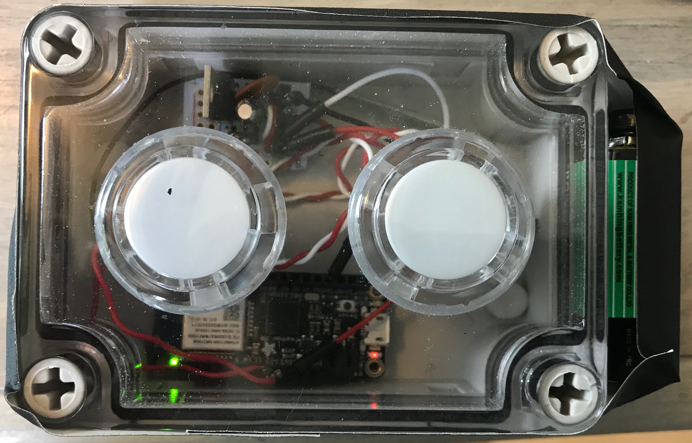
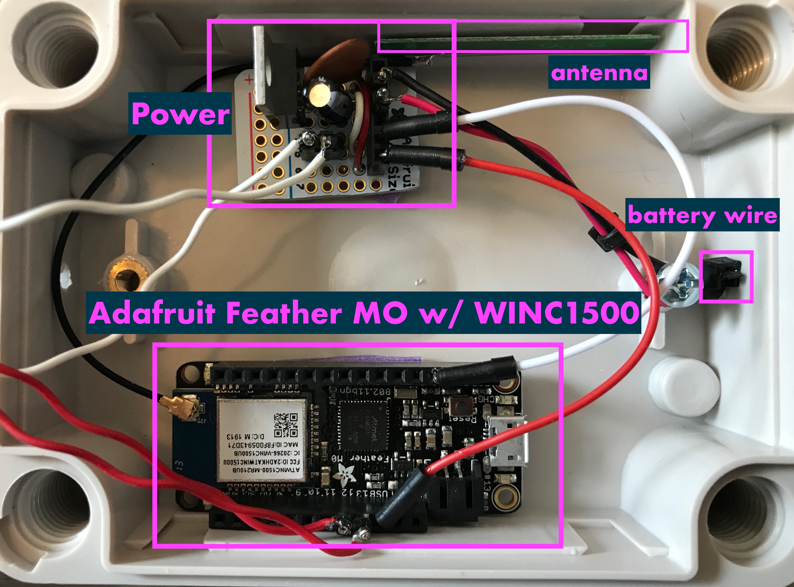
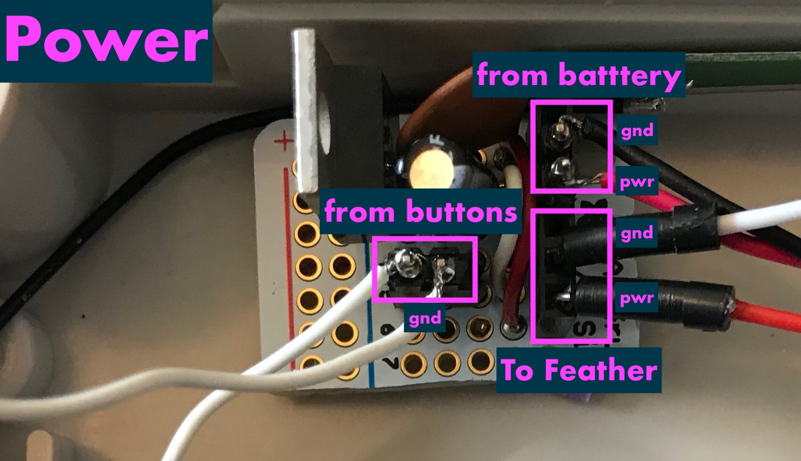
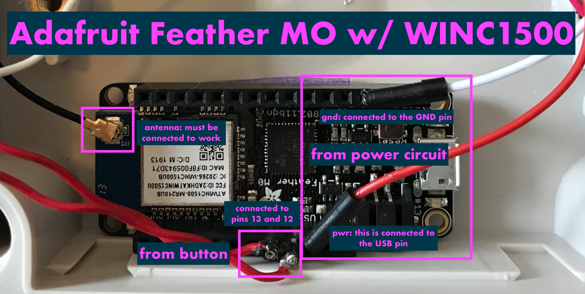
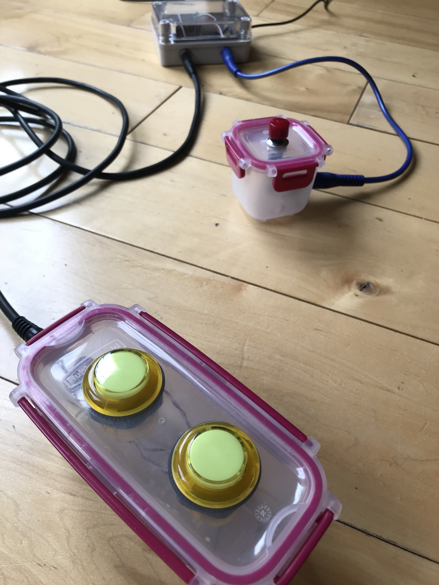
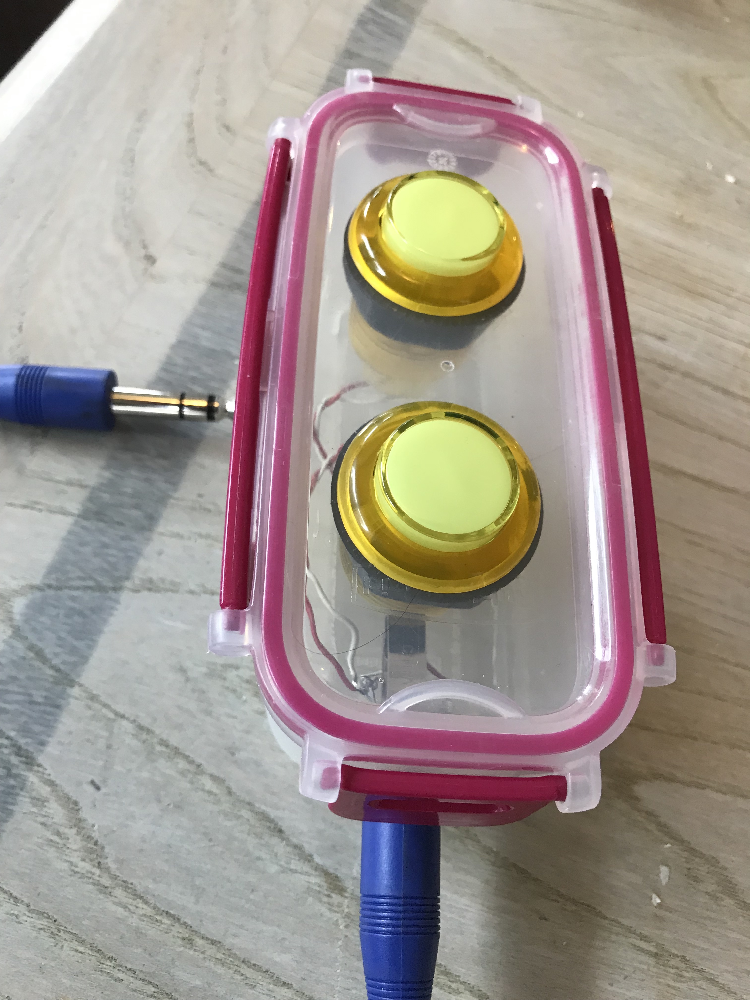

# FullyCommittedInterfaceDesign
Documentation of the interfaces designed and built for the sound design of Fully Committed at Hartford TheatreWorks, summer 2019.

<H2>The Set up pf the a remote, two button interface that can be worn and communicates to QLab to control sound cues over wifi through port 53535.</H2>
 
</img>  
 
</img>  
 
</img>  
 
</img>  

<H2>The wired buttons communicates to QLab through MIDI using noteon messages on the notes: 60,70,80</H2> 
Right now this requires a Max/MSP patch to be running in te background. You will need to select the correct serial interface (pull down menu) and double click on the midiout obect to select Qlab. You can monitor midi input in the Qlab status window
 
</img>  
 
</img>  
 
</img>  
